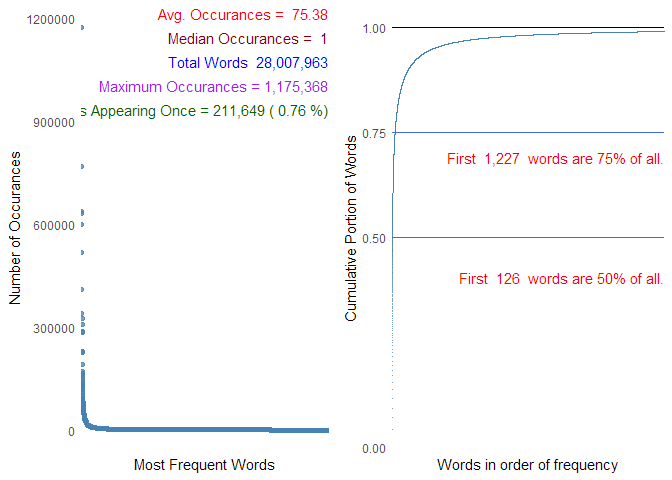
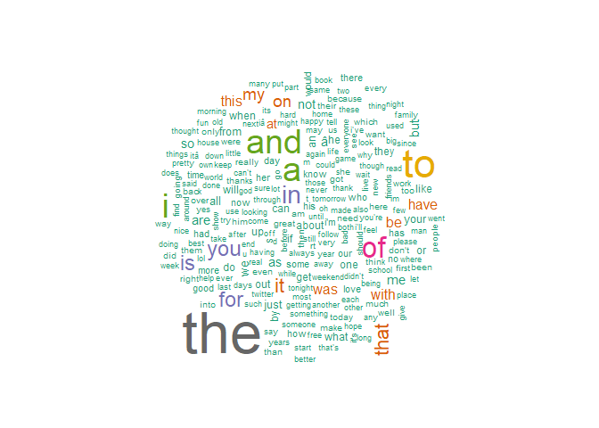
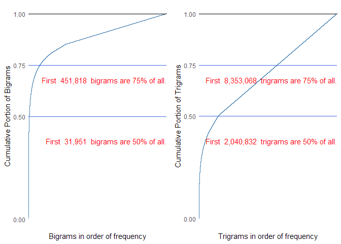
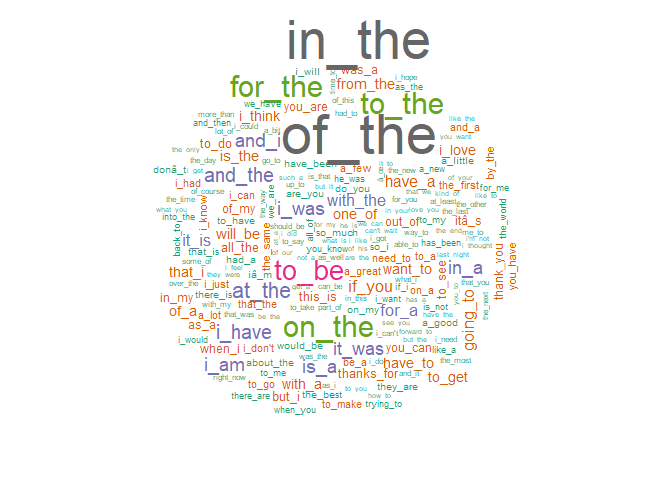
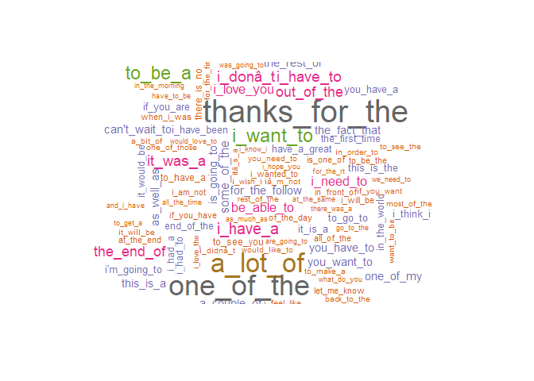

## Introduction

The Capstone project for the Coursera Data Science specialization
requires creating a predictive text Shiny application. Predictive text
is a common function in our digital world where our mobile device or
computer offers suggestions for the next word in a text entry. This is
particularly useful on mobile devices where text entry mechanics are
slower or more cumbersome.

We are given three data files for each of several languages to use to
build a predictive text model. This report explores the available data
and offers a roadmap for further steps toward creating a Shiny
predictive text application.

### Note to Reviewers

I elected to show the considerable code used to prepare the data sets
and perform the exploratory data analysis. The text discussion should be
sufficient for evaluation and the code is provided for completeness.

## Data Management

Data for training and validation are provided by the course instructors
in German, Finnish, Russian, and English. Three files are provided for
each language with text strings mined from blogs, news, and Twitter. The
remainder of this project considers only English-language text modeling.

The first thing to notice about the provided data is that it is
extensive.


```r
library(stringi)
library(gdata)

inputFiles <- c("Data\\final\\en_US\\en_US.twitter.txt", 
                "Data\\final\\en_US\\en_US.news.txt", 
                "Data\\final\\en_US\\en_US.blogs.txt")
for(i in 1:3) {
    print(paste("File: ", inputFiles[i],"  Size: ",
                humanReadable(file.size(inputFiles[i]), 
                              standard="SI",
                              width=4)))
}
```

```
## [1] "File:  Data\\final\\en_US\\en_US.twitter.txt   Size:  167 MB"
## [1] "File:  Data\\final\\en_US\\en_US.news.txt   Size:  206 MB"
## [1] "File:  Data\\final\\en_US\\en_US.blogs.txt   Size:  210 MB"
```

This large amount of data requires we take into account memory and
processing burdens. In light of this, we will:

1.  Break the data into smaller files for development and larger files
    for final model development.

2.  Process the data in chunks instead of loading an entire file into
    memory at once. This will allow for processing very large data sets
    regardless of memory resources, but it will add processing overhead.

### Splitting Data Files

The data is randomly split into several subsets to facilitate training
and testing data sets and providing a smaller data set to use during
development. The data from all three files (blogs, news, and Twitter)
are merged into the final data files and will not be treated separately
from here on out.

-   Development data -- A small subset used to develop the model and
    application (1% of data)

    -   dev-training data -- for training the NLP model (0.7% of data)
    -   dev-testing data -- for testing the NLP model (0.3% of data)

-   Production data -- A large subset we will use for final learning and
    testing (100% of data

    -   prod-training data -- for training the NLP model (40%)
    -   prod-testing data -- for testing the NLP model (10%)
    -   prod-validation data -- large data set set aside for final
        validation if needed (50%)

    
    ```r
    chanceDev <- 0.01
    chanceDevTrain <- 0.7
    chanceProdValid <- 0.5
    chanceProdTrain <- 0.8
    
    devTrainFile<-"Data\\final\\en_US\\dev-training.txt"
    if(file.exists(devTrainFile)) unlink(devTrainFile)
    file.create(devTrainFile)
    conDevTrain <- file(devTrainFile, open="w")
    
    devTestFile<-"Data\\final\\en_US\\dev-testing.txt"
    if(!file.exists(devTestFile)) unlink(devTestFile)
    file.create(devTestFile)
    conDevTest <- file(devTestFile, open="w")
    
    prodValidFile<-"Data\\final\\en_US\\prod-validation.txt"
    if(!file.exists(prodValidFile)) unlink(prodValidFile)
    file.create(prodValidFile)
    conProdValid <- file(prodValidFile, open="w")
    
    prodTrainFile<-"Data\\final\\en_US\\prod-training.txt"
    if(!file.exists(prodTrainFile)) unlink(prodTrainFile)
    file.create(prodTrainFile)
    conProdTrain <- file(prodTrainFile, open="w")
    
    prodTestFile<-"Data\\final\\en_US\\prod-testing.txt"
    if(!file.exists(prodTestFile)) unlink(prodTestFile)
    file.create(prodTestFile)
    conProdTest <- file(prodTestFile, open="w")
    
    # Loop through all three input files and split them out
    for(i in 1:length(inputFiles)) {
        conInput <- file(inputFiles[i], "r") 
        # Read in the file line by line
        while (TRUE) {
            line = readLines(conInput, n = 1)
            if ( length(line) == 0 ) {
                break
            }
            # Flip coin to include in the development data set
            if(rbinom(1, 1, chanceDev)==1) {
                # Flip coin if in development training set
                if(rbinom(1, 1, chanceDevTrain) == 1) {
                    writeLines(line, conDevTrain)
                } 
                else {
                    writeLines(line, conDevTest)
                }
            }
            # All of the data will be included in one of three 
            # production data sets
            # Flip a coin if added to validation data set
            if(rbinom(1, 1, chanceProdValid)==1) {
                writeLines(line, conProdValid)
            }
            else if(rbinom(1, 1, chanceProdTrain)==1) {
                writeLines(line, conProdTrain)
            } else {
                writeLines(line, conProdTest)
            }
           
        }
        # Close the input file
        close(conInput)
    }
    
    # Close all of the output files
    close(conDevTrain)
    close(conDevTest)
    close(conProdValid)
    close(conProdTrain)
    close(conProdTest)
    ```

## Pre-processing and Cleaning the Data

The text in the data sets needs to be pre-processed before we continue
our analysis. There are several common steps used in NLP to prepare text
for analysis. We use some of these approaches but not all are
appropriate for this project:

-   Punctuation - Since we are predicting based on words, punctuation
    must be removed to avoid including them in the words and creating
    unnecessary extra words in the model (e.g. we want "only", "only,",
    and "only." to all be treated the same. Note, this will not be
    perfect in predicting the words at the start of a new sentence and
    may need to be modified later. For now, all punctuation is removed
    for the exploratory analysis.

-   Special characters - Special characters may at best not add any
    value or can cause some analysis library functions to fail (e.g. end
    of line characters). Note, we remove "#" meaning Twitter hashtags
    will be treated like any other text.

-   Capitalization -- Convert all of the characters to lower case to
    ensure consistency in the model regardless of if it is at the start
    of the sentence or elsewhere. This will also catch the common
    miscapitalization typo. A weakness, though, is when a proper noun or
    acronym are treated the same as a different word with the same
    spelling. (e.g. "may," "May," and "M.A.Y." will appear the same in
    the model.)

-   Numbers - Remove all numbers from the string.

-   Stemming -- A common NLP pre-processing function is to convert words
    to their common origin. For example, "moving," "movement," and
    "mover" will all convert to their common root of "move." We will not
    perform stemming, because this type of pre-processing is not
    appropriate for predictive text modeling.

-   Stop words -- Stop words are short, high frequency words that have
    little to no added value to the sentence. (e.g. "a," "I," "we," and
    "or") We want our predictive text model to take these words into
    account even if they add little value to the meaning of the
    sentence. We will not remove stop words.

-   Profanity -- Use the Shutterstock list of bad words to filter for
    profanity.


```r
require(quanteda)
require(quanteda.textmodels)
require(quanteda.textstats)
require(quanteda.textplots)
require(readtext)
require(devtools)
require(quanteda.corpora)

# Setup parallel processing
library(parallel)
library(doParallel)
cluster <- makeCluster(detectCores() - 1) # convention to leave 1 core for OS
registerDoParallel(cluster)

# The default threads used by quanteda is 2. Increase this to use all but one thread on the local processor to improve performance but leave some space for other processes.
quanteda_options("threads"=detectCores() - 1)

set.seed(123)

# Load in the shutterstock list of profane words
profane <- readLines("https://raw.githubusercontent.com/LDNOOBW/List-of-Dirty-Naughty-Obscene-and-Otherwise-Bad-Words/master/en")
```

The next step is complicated and computationally intensive. However,
there are a few key pieces in this sections to break down.

-   The analysis is done on our training data only. The plan is that
    during development I would use the dev-training.txt file, while in
    the final version of this document I'd use prod-training.txt.

-   The data sets are large enough that you are likely to run out of RAM
    if you try to process the entire file at once. Therefore, the script
    processes the file in smaller chunks and accumulates the analysis
    over the whole file.

-   Parallel processing is used to decrease computation time.

-   The algorithm uses the `quanteda`. This package proved to be
    significantly faster and easier to use than the `tm`package.

    -   The text chunk is converted to a corpus

    -   The corpus is tokenized by word, bigram, and trigram.

-   The occurrence count of each word, bigram, and trigram are tracked
    for each chunk. The results for each chunk are added to the global
    DFM which automatically accounts for duplicate matches.


```r
# The data file to analyze
devTrainFile<-"Data\\final\\en_US\\prod-training.txt"
conFile <- file(devTrainFile, "r") 


# Create where we are going to store the exploratory data analysis info
countsLine <- data.frame(WordChars = NULL, Words  = NULL, WordLen = NULL)
# Loop through the data file and process in chunks. Necessary
# to manage memory use for very large data sets
# Number of lines to process in each chunk
dataChunk <- 4000
DFM_onegram <- NULL
DFM_2gram <- NULL
DFM_3gram <- NULL
loop = TRUE
while (loop) {
    # read lines from the file until there is nothing left and break
    text = readLines(conFile, n = dataChunk)
    if ( length(text) == 0 ) {
        break
    }
    # convert the chunk of lines into a corpus
    docs <- quanteda::corpus(text)

    # Convert the document into a list of tokens removing the stuff we don't
    # want that can be done within the function
    toks <- quanteda::tokens(docs, remove_punct=TRUE, remove_symbols = TRUE, 
                   remove_numbers = TRUE, remove_url = TRUE, 
                   remove_separators = TRUE, split_hyphens = TRUE, 
                   tolower=TRUE)
    toksClean <- quanteda::tokens_remove(toks, profane)
    
    # Create the 1, 2, 3-grams
    toks_2grams <- tokens_ngrams(toksClean, n=2)
    toks_3grams <- tokens_ngrams(toksClean, n=3)

    # Create or add to the DFM for the onegrams
    if( is.null(DFM_onegram)) {
        DFM_onegram <- dfm(toksClean)
    } else {
        DFM_onegram <- rbind(DFM_onegram, dfm(toksClean))
    }
    # Create or add to the DFM for the two-grams
    if( is.null(DFM_2gram)) {
        DFM_2gram <- dfm(toks_2grams)
    } else {
        DFM_2gram <- rbind(DFM_2gram, dfm(toks_2grams))
    }
    # Create or add to the DFM for the three-grams
    if( is.null(DFM_3gram)) {
        DFM_3gram <- dfm(toks_3grams)
    } else {
        DFM_3gram <- rbind(DFM_3gram, dfm(toks_3grams))
    }
}
print("Onegram Totals")
totals_onegram <- colSums(DFM_onegram)
print(head(totals_onegram, 25))
print("Two-gram Totals")
totals_2gram <- colSums(DFM_2gram)
print(head(totals_2gram, 25))
print("Three-gram Totals")
totals_3gram <- colSums(DFM_3gram)
print(head(totals_3gram, 25))


close(conFile)
## Close parallel processing
stopCluster(cluster)
registerDoSEQ()
```

## Exploratory Analysis

### Single Word Exploratory Analysis

Using the data collected above, we create plots to better understand
which words occur most frequently in our training data set. First,
though, calculate the total words, what portion of total words each word
encompasses, and the cumulative portion of all words starting from the
most frequent and going to the least.


```r
library(ggplot2)
library(dplyr)
library(ggpubr)
library(stringi)

ogram <- data.frame(freq = totals_onegram)
ogram <- dplyr::as_tibble(ogram, rownames = "word")
bgram <- data.frame(word = NULL,freq=NULL)
tgram <- data.frame(word = NULL,freq=NULL)

# Get the total words, sort the data frame by word count and add
# columns for the fraction of total and cumulative fraction
wordsTotal <- sum(ogram$freq)
oneTotal <- sum(ogram$freq == 1)
ogram <- ogram %>% arrange(desc(freq)) 
ogram <- ogram %>% mutate(fract = freq/wordsTotal)
cumfract = cumsum(ogram$fract)
ogram <- cbind(ogram, as.data.frame(cumfract))

# Get the list of words that make up half of the total occurrence of words
# dhalf <- filter(ogram, cumfract <= 0.50)
# Plot a distribution of all words and of the most common
ogram$word <- factor(ogram$word, levels = ogram$word)
freqLimit <- 200
smD <- ogram[which(ogram$freq>freqLimit),]
smDDist <- ggplot(smD, aes(y=freq, x=factor(word)))
smDDist <- smDDist + geom_point(stat = "identity", alpha=0.75, color="steelblue")
MeanX <- mean(ogram$freq,na.rm=TRUE)
MedX <- median(ogram$freq, na.rm=TRUE)
Max <- max(ogram$freq,na.rm=TRUE)
smDDist <- smDDist + annotate("text", x=Inf, y=Inf, hjust=1, vjust=1,
                                label=paste("Avg. Occurances = ", signif(MeanX,4)),
                                color="red")
smDDist <- smDDist + annotate("text", x=Inf, y=Inf, hjust=1, vjust=3,
                                label=paste("Median Occurances = ", MedX),
                                color="darkred")
smDDist <- smDDist + annotate("text", x=Inf, y=Inf, hjust=1, vjust=5,
                            label=paste("Total Words ", 
                                        format(wordsTotal, big.mark=",")),
                            color="blue")
smDDist <- smDDist + annotate("text", x=Inf, y=Inf, hjust=1, vjust=7,
                              label=paste("Maximum Occurances =", 
                                          format(Max, big.mark=",")),
                              color="purple")
smDDist <- smDDist + annotate("text", x=Inf, y=Inf, hjust=1, vjust=9,
                              label=paste("Words Appearing Once =", 
                                          format(oneTotal, big.mark=","), "(",
                                          signif(oneTotal*100/wordsTotal,2),"%)"),
                              color="darkgreen")
smDDist <- smDDist + theme(axis.ticks=element_blank(), 
                           axis.text.x = element_blank())
smDDist <- smDDist + xlab("Most Frequent Words") + ylab("Number of Occurances")

smogramFreq <- ogram[which(ogram$freq>2),]
ogramFreq <- ggplot(smogramFreq, aes(y=cumfract, x=factor(word)))
ogramFreq <- ogramFreq + geom_point(stat = "identity", alpha=0.75, 
                                    color="steelblue", shape=".")
ogramFreq <- ogramFreq + theme(axis.ticks=element_blank(), 
                               axis.text.x = element_blank())
ogramFreq <- ogramFreq + scale_y_continuous(breaks=c(0.0, 0.5, 0.75, 1.0))
ogramFreq <- ogramFreq + geom_hline(yintercept=0.5, color="royalblue")
ogramFreq <- ogramFreq + geom_hline(yintercept=0.75, color="royalblue")
ogramFreq <- ogramFreq + geom_hline(yintercept=1.0, color="black")
library(purrr)
percFunct <- function(x, perc) x>perc
half <- detect_index(ogram$cumfract, percFunct, 0.5)
threequarter <- detect_index(ogram$cumfract, percFunct, 0.75)
ogramFreq <- ogramFreq + annotate("text", x=-Inf, y=Inf, 
                                  hjust = -2, vjust=1, 
                                  label="100%", color="black", angle=90)
ogramFreq <- ogramFreq + annotate("text", x=-Inf, y=Inf, 
                                  hjust = -2, vjust=21, 
                                  label="50%", color="royalblue", angle=90)
ogramFreq <- ogramFreq + annotate("text", x=-Inf, y=Inf, 
                                  vjust = -2, hjust=12, 
                                  label="75%", color="royalblue", angle=90)
ogramFreq <- ogramFreq + annotate("text", x=Inf, y=Inf, hjust=1, vjust=23,
                                  label=paste("First ",
                                              format(half, big.mark=","), 
                                              " words are 50% of all."),
                                  color="red")
ogramFreq <- ogramFreq + annotate("text", x=Inf, y=Inf, hjust=1, vjust=13,
                                  label=paste("First ",
                                              format(threequarter,big.mark=","), 
                                              " words are 75% of all."),
                                  color="red")
ogramFreq <- ogramFreq + xlab("Words in order of frequency") + ylab("Cumulative Portion of Words")
q <- ggarrange(smDDist, ogramFreq, ncol=2)
print(q )
```

<!-- -->

It is clear that a dictionary of only a few words can cover the majority
of words used in our training set. For example, the most common 126
words comprise half of the words in the training set, and
1227 make up 75% of the data set. We can use this to reduce
the size of the learned data set and make the predictive text system
more responsive and portable to mobile devices. The word cloud shows the
most common words that occur. Note that many of the most common words
are stop words. The emphasizes the importance of not removing them for a
predictive text tool.


```r
#wordcloud
library(wordcloud)
wordcloud(ogram$word,ogram$freq, max.words = 250, colors=brewer.pal(8, "Dark2"))
```

<!-- -->

### Bigram and Trigram Exploratory Analysis

It is likely that our predictive text model will rely first on N-grams
to determine the most likely next word. To better understand the
distribution of N-grams in the training data set, repeat the exploratory
analysis on bigrams (2-grams) and trigrams (3-grams).


```r
bgram <- data.frame(freq=totals_2gram)
tgram <- data.frame(freq=totals_3gram)
bgram <- dplyr::as_tibble(bgram, rownames = "word")
tgram <- dplyr::as_tibble(tgram, rownames = "word")

# Get the total words, sort the data frame by word count and add
# columns for the fraction of total and cumulative fraction
bigramTotal <- sum(bgram$freq)
bgram <- bgram %>% arrange(desc(freq)) 
bgram <- bgram %>% mutate(fract = freq/bigramTotal)
cumfract = cumsum(bgram$fract)
bgram <- cbind(bgram, as.data.frame(cumfract))

# Get the list of words that make up half of the total occurrence of words
# dhalf <- filter(ogram, cumfract <= 0.50)
# Plot a distribution of all words and of the most common
bgram$word <- factor(bgram$word, levels = bgram$word)
bMeanX <- mean(bgram$freq,na.rm=TRUE)
bMedX <- median(bgram$freq, na.rm=TRUE)
bMax <- max(bgram$freq,na.rm=TRUE)
# smbgramFreq <- bgram[which(bgram$freq>2),]
smbgramFreq <- bgram
bgramFreq <- ggplot(smbgramFreq, aes(y=cumfract, x=factor(word)))
bgramFreq <- bgramFreq + geom_point(stat = "identity", alpha=0.75, 
                                    color="steelblue", shape=".")
bgramFreq <- bgramFreq + theme(axis.ticks=element_blank(), 
                               axis.text.x = element_blank())
bgramFreq <- bgramFreq + scale_y_continuous(breaks=c(0.0, 0.5, 0.75, 1.0))
bgramFreq <- bgramFreq + geom_hline(yintercept=0.5, color="royalblue")
bgramFreq <- bgramFreq + geom_hline(yintercept=0.75, color="royalblue")
bgramFreq <- bgramFreq + geom_hline(yintercept=1.0, color="black")
library(purrr)
percFunct <- function(x, perc) x>perc
halfBi <- detect_index(bgram$cumfract, percFunct, 0.5)
threequarterBi <- detect_index(bgram$cumfract, percFunct, 0.75)
bgramFreq <- bgramFreq + annotate("text", x=-Inf, y=Inf, 
                                  vjust = -2, hjust=1, 
                                  label="100%", color="black", angle=90)
bgramFreq <- bgramFreq + annotate("text", x=-Inf, y=Inf, 
                                  vjust = -2, hjust=21, 
                                  label="50%", color="royalblue", angle=90)
bgramFreq <- bgramFreq + annotate("text", x=-Inf, y=Inf, 
                                  vjust = -2, hjust=12, 
                                  label="75%", color="royalblue", angle=90)
bgramFreq <- bgramFreq + annotate("text", x=Inf, y=Inf, hjust=1, vjust=23,
                                  label=paste("First ",
                                              format(halfBi,big.mark=","), 
                                              " bigrams are 50% of all."),
                                  color="red")
bgramFreq <- bgramFreq + annotate("text", x=Inf, y=Inf, hjust=1, vjust=13,
                                  label=paste("First ",
                                              format(threequarterBi, big.mark=","), 
                                              " bigrams are 75% of all."),
                                  color="red")
bgramFreq <- bgramFreq + xlab("Bigrams in order of frequency") + ylab("Cumulative Portion of Bigrams")

# Get the total words, sort the data frame by word count and add
# columns for the fraction of total and cumulative fraction
trigramTotal <- sum(tgram$freq)
tgram <- tgram %>% arrange(desc(freq)) 
tgram <- tgram %>% mutate(fract = freq/trigramTotal)
cumfract = cumsum(tgram$fract)
tgram <- cbind(tgram, as.data.frame(cumfract))

# Get the list of words that make up half of the total occurrence of words
# dhalf <- filter(ogram, cumfract <= 0.50)
# Plot a distribution of all words and of the most common
tgram$word <- factor(tgram$word, levels = tgram$word)
tMeanX <- mean(tgram$freq,na.rm=TRUE)
tMedX <- median(tgram$freq, na.rm=TRUE)
tMax <- max(tgram$freq,na.rm=TRUE)
# smtgramFreq <- tgram[which(tgram$freq>2),]
smtgramFreq <- tgram
tgramFreq <- ggplot(smtgramFreq, aes(y=cumfract, x=factor(word)))
tgramFreq <- tgramFreq + geom_point(stat = "identity", alpha=0.75, 
                                    color="steelblue", shape=".")
tgramFreq <- tgramFreq + theme(axis.ticks=element_blank(), 
                               axis.text.x = element_blank())
tgramFreq <- tgramFreq + scale_y_continuous(breaks=c(0.0, 0.5, 0.75, 1.0))
tgramFreq <- tgramFreq + geom_hline(yintercept=0.5, color="royalblue")
tgramFreq <- tgramFreq + geom_hline(yintercept=0.75, color="royalblue")
tgramFreq <- tgramFreq + geom_hline(yintercept=1.0, color="black")
library(purrr)
percFunct <- function(x, perc) x>perc
halfTri <- detect_index(tgram$cumfract, percFunct, 0.5)
threequarterTri <- detect_index(tgram$cumfract, percFunct, 0.75)
tgramFreq <- tgramFreq + annotate("text", x=-Inf, y=Inf, 
                                  vjust = -2, hjust=1, 
                                  label="100%", color="black", angle=90)
tgramFreq <- tgramFreq + annotate("text", x=-Inf, y=Inf, 
                                  vjust = -2, hjust=21, 
                                  label="50%", color="royalblue", angle=90)
tgramFreq <- tgramFreq + annotate("text", x=-Inf, y=Inf, 
                                  vjust = -2, hjust=12, 
                                  label="75%", color="royalblue", angle=90)
tgramFreq <- tgramFreq + annotate("text", x=Inf, y=Inf, hjust=1, vjust=23,
                                  label=paste("First ",
                                              format(halfTri,big.mark=","), 
                                              " trigrams are 50% of all."),
                                  color="red")
tgramFreq <- tgramFreq + annotate("text", x=Inf, y=Inf, hjust=1, vjust=13,
                                  label=paste("First ",
                                              format(threequarterTri, big.mark=","), 
                                              " trigrams are 75% of all."),
                                  color="red")
tgramFreq <- tgramFreq + xlab("Trigrams in order of frequency") + ylab("Cumulative Portion of Trigrams")


q <- ggarrange(bgramFreq, tgramFreq, ncol=2)
q <- q + ggtitle("Occurance of N-grams in the Training Set")
print(q )
```

<!-- -->

```r
# Create a table with stats from the N-grams
boneTotal <- sum(bgram$freq == 1)
toneTotal <- sum(tgram$freq == 1)
ngramTable <- data.frame(bgram = c(format(bigramTotal, big.mark=","), 
                                   bMax, signif(bMeanX,4), 
                                   bMedX, signif(boneTotal*100/bigramTotal, 3)),
                         tgram = c(format(trigramTotal, big.mark=","), 
                                   tMax, signif(tMeanX,4), 
                                   tMedX, signif(toneTotal*100/trigramTotal, 3)),
                         row.names = c("Total", "Max Occurance", 
                                       "Mean Occurance", "Median Occurance",
                                       "Percent Occuring Once")
                         ) 
library(reactable)
reactable(ngramTable,
          columns = list(bgram = colDef(name = "Bigrams (2-grams)"),
                         tgram = colDef(name = "Trigrams (3-grams)")
  ))
```

```{=html}
<div id="htmlwidget-bfe63ab0fedb3667d064" class="reactable html-widget" style="width:auto;height:auto;"></div>
<script type="application/json" data-for="htmlwidget-bfe63ab0fedb3667d064">{"x":{"tag":{"name":"Reactable","attribs":{"data":{".rownames":["Total","Max Occurance","Mean Occurance","Median Occurance","Percent Occuring Once"],"bgram":["26,674,156","103174","4.909","1","14.8"],"tgram":["25,348,088","9433","1.726","1","49.8"]},"columns":[{"accessor":".rownames","name":"","type":"character","sortable":false,"filterable":false},{"accessor":"bgram","name":"Bigrams (2-grams)","type":"character"},{"accessor":"tgram","name":"Trigrams (3-grams)","type":"character"}],"defaultPageSize":10,"paginationType":"numbers","showPageInfo":true,"minRows":1,"dataKey":"857ebcd5422da9db54ef56432646d95c","key":"857ebcd5422da9db54ef56432646d95c"},"children":[]},"class":"reactR_markup"},"evals":[],"jsHooks":[]}</script>
```

Important to notice about bigrams and trigrams is that far fewer of them
appear more than once. That means there is significantly less value
achieved by limiting the number of N-grams used in modeling. Notice that
the cumulative fraction curve changes from an exponential curve shape to
linear. This is the point where all of the remaining n-grams appear once
in the data set. Setting a cutoff in this section will be arbitrary
because which side of the break an n-gram appears will depend on how
they are sorted in the list.

The word clouds below show the most common bi- and tri-grams in the
training data set.


```r
#wordcloud
wordcloud(bgram$word,bgram$freq, max.words=200,
          scale=c(3.5,0.25), colors=brewer.pal(8, "Dark2"))
```

<!-- -->

```r
wordcloud(tgram$word,tgram$freq, max.words=100,
          scale=c(2.5,0.15), colors=brewer.pal(8, "Dark2"))
```

<!-- -->

## Next Steps

The next steps consist of creating a predictive model based upon the
trigram, bigram, and word occurrence information collected above. This
model will be exported and used in a Shiny interface to demonstrate a
simple predictive text editor. Some of the chief concerns are how to
efficiently create, store and use the models, how too handle unexpected
words, how to evaluate the performance of the models, and the design of
the demonstration Shiny app.

### Modeling

I found during the exploratory analysis phase that the `tm`package is
not suitable for larger data sets. I processed the data sets in chunks
to ensure sufficient RAM memory, yet with larger data sets, the
`tm`package took days to complete tokenization and would sometimes hang
up and never finish. This version of the milestone report uses the
`quanteda`package. Execution times were significantly shorter allowing
for a larger training set.

Markov-chain models will be used as they appear to combine sufficient
accuracy and compactness suitable for quickly providing feedback to the
user. I will limit the number of words, bigrams, and trigrams used in
the model to improve efficiency. The cutoff will be selected to balance
the amount of useful information contained in the training set (i.e.
accuracy) with efficiency. It is clear from the exploratory analysis
that a small subset of words account for the bulk of occurances in the
data set. A larger training data set will make this more useful so that
a cutoff for bigrams and trigrams isn't set arbitrarily among patterns
that appear only once in the data set.

A smoothing method will be used to account for words not contained in
the model. I will most likely compare the performance of the
stupid-backoff model with the Katz's backoff model. The stupid-backoff
model is simpler and preferable if the accuracy is sufficient. In either
case, I will limit the n-grams to 3, 2, and 1.

The data sets were split into training and testing sets to set aside a
separate set of data to verify the final model performance before
releasing it to the real world. Models will be evaluated for prediction
accuracy as well as performance.

### Predictive Text App

The Shiny app will be simple and straight forward and intended to
replicate the behavior of modern predictive text systems. There will be
a text area for the user to enter words and a list showing a number of
suggested next words.
